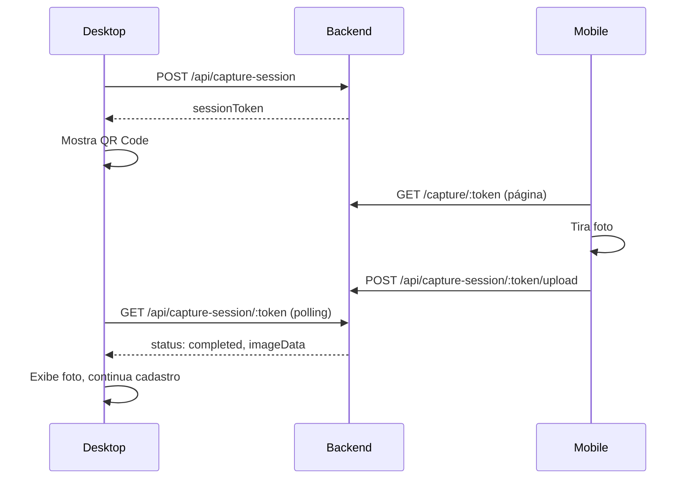

# Walkthrough: Captura Remota de Foto via QR Code

## Problema Resolvido
Usuários desktop sem webcam não conseguiam tirar selfie no cadastro.

## Solução Implementada
QR Code que permite tirar foto no celular e enviar para o desktop.

## Arquivos Criados/Modificados

### Backend
| Arquivo | Mudança |
|---------|---------|
| `shared/schema.ts` | Nova tabela `capture_sessions` |
| `server/routes.ts` | 3 endpoints: create, status, upload |

### Frontend
| Arquivo | Mudança |
|---------|---------|
| `client/src/pages/RemoteCapture.tsx` | Nova página mobile |
| `client/src/App.tsx` | Rota `/capture/:token` |
| `client/src/components/WebcamCapture.tsx` | Polling + auto-session |

## Fluxo

## Validação
- [ ] Rodar `npm run db:push` para criar tabela
- [ ] Testar fluxo desktop → mobile → desktop
